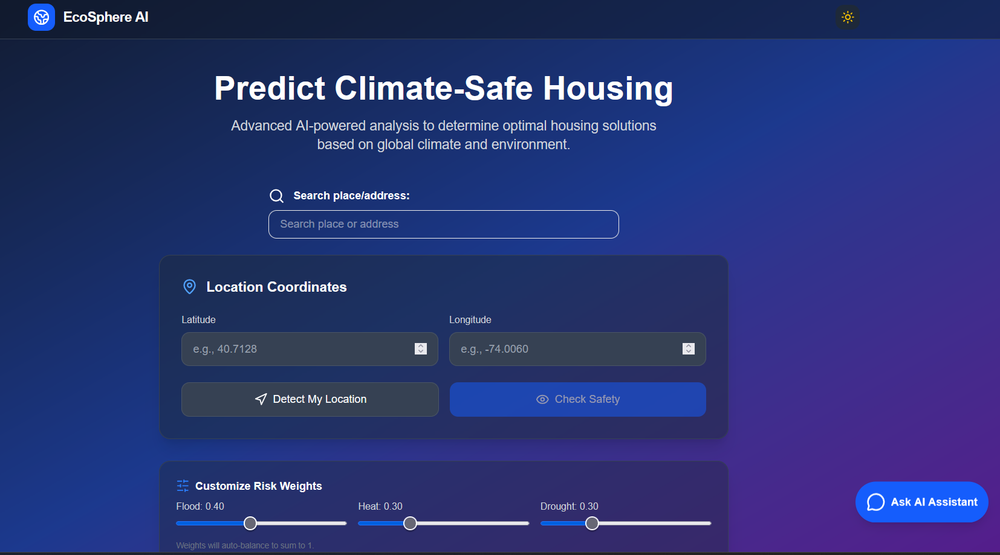
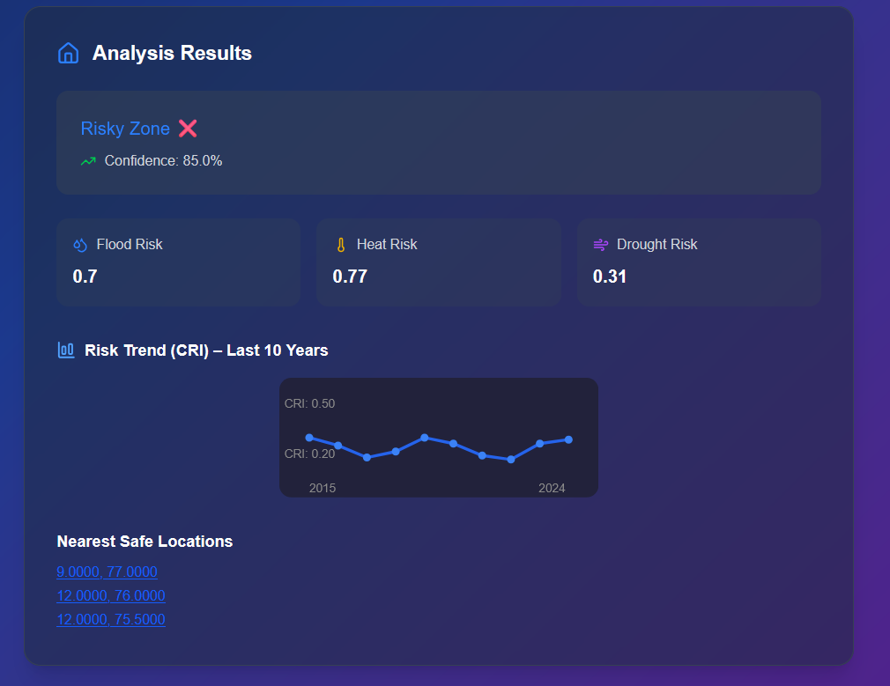

# EcoSphere AI: Explainable AI for Climate-Smart Housing

[](https://scrs.in/conference/cis2025)

EcoSphere AI is an advanced, end-to-end system designed to evaluate global housing safety risks associated with climate change-induced hazards like **floods, heatwaves, and droughts**. It provides real-time, actionable insights for urban planners, policymakers, and individuals, contributing to the development of safer, more resilient communities.

This project has been accepted for presentation at the **6th Congress on Intelligent Systems (CIS 2025)** and for publication in the SCOPUS-indexed Springer Book Series, 'Lecture Notes in Networks and Systems'.

***

## 📸 Screenshots

Here's a glimpse of the EcoSphere AI user interface.

| Main Interface | Analysis Results |
| :---: | :---: |
|  |  |

***

## ✨ Key Features

* **Multi-Hazard Risk Assessment:** Evaluates housing safety against floods, heatwaves, and droughts on a global scale.
* **High-Accuracy Predictions:** Utilizes an optimized **XGBoost** classifier that achieves a high predictive accuracy with an Area Under the Curve (AUC) of 0.92.
* **Explainable AI (XAI):** Integrates **SHAP** (SHapley Additive exPlanations) to provide transparent, feature-level explanations for each prediction, enhancing user trust.
* **Interactive Web Interface:** A modern frontend built with **Next.js** allows users to get instant risk assessments by searching for an address, using geolocation, or clicking on an interactive map.
* **Safe Zone Recommendations:** Identifies and suggests the nearest safe locations based on the risk analysis.
* **Conversational AI Assistant:** Features an integrated chatbot powered by **Gemini** to provide user-friendly decision support and answer questions.
* **Scalable Cloud Architecture:** Fully deployed on **Google Cloud** (Vertex AI, BigQuery, Cloud Run) for real-time, scalable inference and robust data processing.

***

## 🏗️ System Architecture

The system is designed as a modular, cloud-native pipeline that ensures scalability, transparency, and responsiveness.

1.  **Data Ingestion & Processing:** Geospatial data for flood, heat, and drought risks are acquired from sources like JRC Global Surface Water and MODIS via **Google Earth Engine**. The data is processed and stored in **Google BigQuery**.
2.  **AI/ML Inference:** The user submits a location from the Next.js frontend. The request is handled by a **FastAPI** backend, which sends the feature vector to a managed **XGBoost** model endpoint on **Google Vertex AI** for real-time prediction.
3.  **Explainability & Response:** For each prediction, the backend computes **SHAP** values to explain the contribution of each risk factor. The prediction, explanation, risk scores, and safe zone suggestions are returned to the user interface.

***

## 💻 Technology Stack

| Category | Technologies |
| :--- | :--- |
| **Frontend** | Next.js, Tailwind CSS, Folium, Leaflet.js |
| **Backend** | Python, FastAPI |
| **AI/ML** | Scikit-learn, XGBoost, SHAP |
| **Cloud & DevOps** | Google Cloud Platform (Vertex AI, BigQuery, Cloud Run, Google Earth Engine), Docker |
| **Database & Storage** | Google BigQuery, Google Cloud Storage |

***

## 🚀 Getting Started

Follow these instructions to set up and run the project locally.

### Prerequisites

* Python 3.9+
* Node.js and npm
* Google Cloud Platform account and a configured service account JSON file (`service-account.json`).

### Installation & Setup

1.  **Clone the repository:**
    ```bash
    git clone [https://github.com/your-username/climate-smart-housing.git](https://github.com/your-username/climate-smart-housing.git)
    cd climate-smart-housing
    ```

2.  **Setup the Backend:**
    ```bash
    # Create and activate a virtual environment
    python -m venv venv
    source venv/bin/activate  # On Windows, use `venv\Scripts\activate`

    # Install Python dependencies
    pip install -r requirements.txt
    ```

3.  **Setup the Frontend:**
    ```bash
    # Navigate to the frontend directory
    cd climate-smart-frontend

    # Install Node.js dependencies
    npm install
    ```

4.  **Environment Variables:**
    * Place your Google Cloud `service-account.json` file in the root directory.
    * Create a `.env` file if needed for other configuration variables (e.g., API keys).

### Running the Application

1.  **Start the Backend Server:**
    * From the root directory, run the FastAPI application.
    ```bash
    uvicorn app:app --reload
    ```

2.  **Start the Frontend Development Server:**
    * In a new terminal, navigate to the `climate-smart-frontend` directory.
    ```bash
    npm run dev
    ```
    * Open your browser and navigate to `http://localhost:3000`.

***

## 📁 File Structure

Here is an overview of the key files in the project repository:
.
├── climate-smart-frontend/ # Next.js frontend application
├── Ne_10m_data/          # Geospatial data files
├── app.py                # Main FastAPI backend application
├── climate_safe_housing_model.pkl # Pre-trained XGBoost model file
├── package.json          # Node.js project configuration
├── requirements.txt      # Python dependencies
├── safe_zones_landonly.csv # CSV file with safe zone coordinates

***

## ✍️ Authors

This project was developed by:

* **Kowshik Padala**
* **Rahul Thota**
* **Teja Sai Sathwik P**
* **Dhanush B**
* **Divya. Udayan J***

From the Department of Computer Science and Engineering, Amrita Vishwa Vidyapeetham, Amritapuri, India.

***

## 📜 License

This project is licensed under the MIT License. See the `LICENSE` file for more details.
